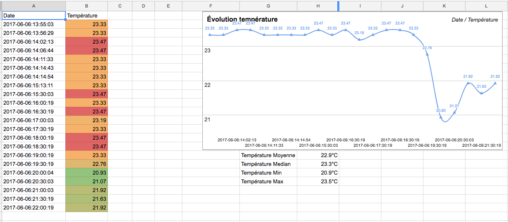

# Thermal hue

Use your Hue Motion Sensor as thermal sensor.

## Quick use

First allow the script to use your Bridge.
```
$ python3 main.py --initbridge
Press the Bridge button, then press Return.
You can edit the settings.py and set the BRIDGE_USERMAME to 'Your-Token'
$ vim settings.py
```

Now the srcipt should output the current temperature.
```
$ python3 main.py
23.05
```

## Sample results



## Use Google Spreadsheets as backend

You can save your data directly to Google Spreadsheets. The Google Script and the Bash script are [here](https://github.com/c4software/thermal-hue/tree/master/google-spreadsheets-backend), I also made a simple app to display temperature data directly to your mobile [Thermal Hue App](https://github.com/c4software/thermal-hue-app)
